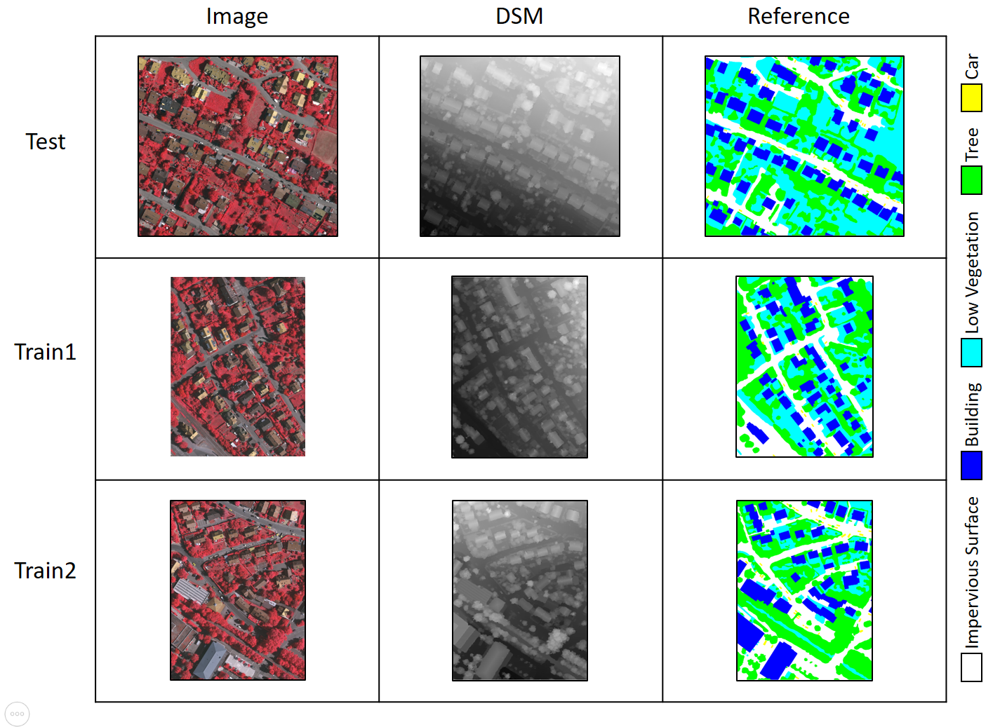
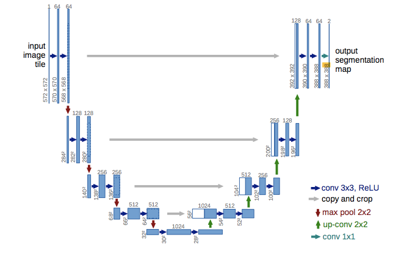
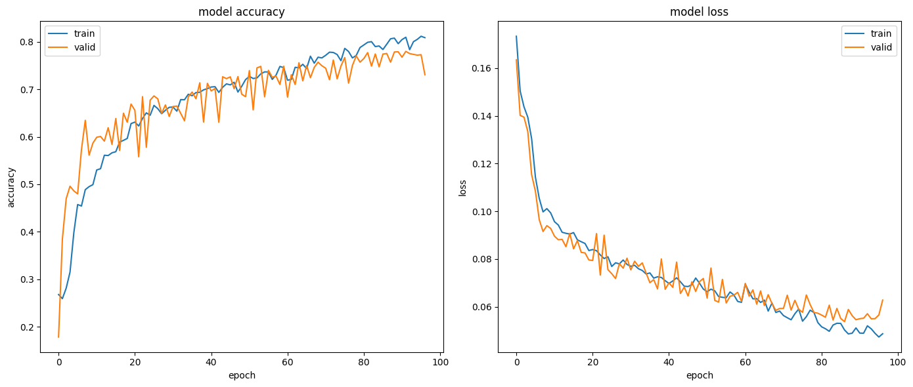
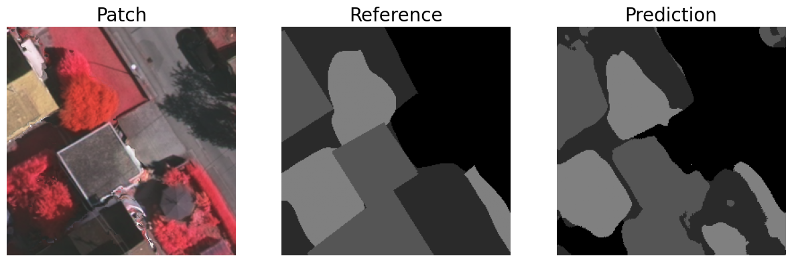
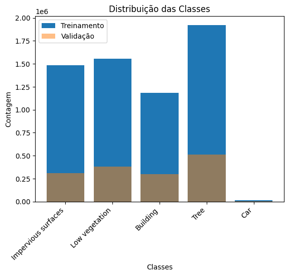
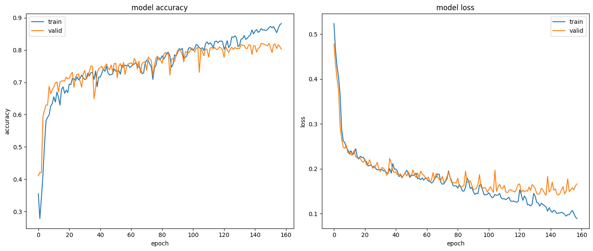
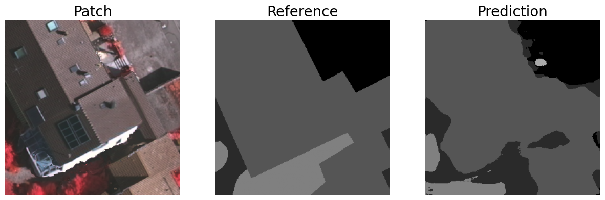

<div style="text-align: center;">

# University of the State of Rio de Janeiro


# 2D ISPRS Semantic Segmentation

<br>**Student: Victor Milhomem**
<br>**Professor: Gilson Costa**

**Rio de Janeiro, June 2023**

</div>

# Introduction

This report aims to build and evaluate models of Convolutional Neural Networks (CNN) for semantic segmentation of images. The ultimate goal is to perform semantic segmentation on images from the [ISPRS 2D Semantic Labeling Contest](https://www.isprs.org/education/benchmarks/UrbanSemLab/2d-sem-label-vaihingen.aspx) (data from the city of Vaihingen).

The images consist of three orthophotos, with a spatial resolution of 9 cm, whose channels correspond to the near infrared, red and green bands provided by the camera. Each orthophoto is accompanied by a Digital Surface Model (DSM), in which each pixel has height information (in pixels), and a reference image (ground truth).

This report will provide a step-by-step guide to implementing the semantic segmentation models, including preparing the data, building the convolutional neural networks and evaluating the results.

# Data pre-processing

In this section, we will describe the pre-processing performed on the input data before training the U-Net for the semantic segmentation task. The pre-processing process can be divided into several steps, as detailed below:

1. **Normalization:** The input images go through a normalization step to ensure that the pixel values are in the range of 0 to 1. This is done using the `normalization` function, which uses the normalization technique of minimum and maximum scale (MinMaxScaler).

2. **Class Mapping:** Reference images (RGB) are mapped to corresponding class labels. The mapping is performed through the `color2label` dictionary, which associates color values with specific class labels.

3. **Creation of Label Images:** Based on the class mapping, the reference images are transformed into label images, where each pixel is assigned the appropriate class label. This step is critical to providing the correct labels during training.

4. **Patch Extraction:** The original images and the label images are divided into rectangular patches. These patches will be used as individual samples during U-Net training. The `extract_patches` function is responsible for carrying out this extraction, allowing you to specify the size of the patches, the displacement between them and the possibility of including patches that overlap the edges of the images.

5. **Division into Training and Validation Sets:** The patch set is divided into training and validation sets. The percentage of patches destined for validation is determined by the `valid_percent` parameter. Corresponding indices are used to separate patches in each set.

6. **Data Augmentation and Data Generator Creation:** Data augmentation transformations are defined for image and label patches. In the provided code, the `orthogonal_rot` transformation performs 90 degree orthogonal rotations. In addition, horizontal and vertical reflections are applied. These transformations increase the diversity of the training data and prevent overfitting.

    The `x_datagen` and `y_datagen` data generators are created using the defined transformations. They will be responsible for applying transformations to input and label data during U-Net training.

At the end of the pre-processing, we have the training and validation sets ready to be used in U-Net training. The training set consists of input image patches (`x_train`) and corresponding label patches (`y_train`). The validation set is composed of `x_valid` and `y_valid`. During training, the data generators will apply data augmentation transformations to the input and label patches, enriching the training set and improving the generalizability of the model.

<div style="text-align: center;">


</div>

In the next topic, we will discuss the U-Net training details based on the previously prepared training and validation sets, as well as the obtained results.

# U-Net

In this experiment, the U-Net model was used to perform the semantic segmentation of the images. U-Net is a convolutional neural network architecture widely used for segmentation tasks. It was proposed by Ronneberger et al. in 2015 and has been effective in accurately segmenting complex structures in images.

The U-Net architecture is characterized by an encoder-decoder structure, in which the "encoder" part captures the resources and context information of the images through convolutional and pooling layers, and the "decoder" part performs the reconstruction and the segmentDetailed tation, using transposed convolutional layers to upsample the features.

<div style="text-align: center;">



</div>

U-Net is known for its ability to capture fine details and precise contours, due to the direct connection between the encoder and decoder layers, which allows the transfer of detailed information. This architecture has become a popular choice in semantic segmentation problems due to its consistent and efficient performance.

## U-Net: Weight of Fixed Classes

In this experiment, we are going to explore the training of the U-Net with fixed class weights, for which the following hyperparameters were used to train the U-Net:

- Batch Size: 16
- Training epochs: 150
- Fixed class weights: [0.10, 0.10, 0.10, 0.10, 2.00]. These weights were assigned to the classes Impervious surfaces, Low vegetation, Building, Tree and Car, respectively.
- Early Stopping: 10 tolerance epochs and a minimum improvement delta of 0.0001 were defined, which means that the training would be stopped if the loss improvement did not exceed this minimum value for 10 consecutive epochs.
- Data augmentation: Data augmentation was enabled to improve model generalization. The number of samples generated by the data generator was set to 4, which means that for each original training image, 4 additional samples with random transformations would be generated.
- Optimizer: The Adam optimizer was used, with a learning rate of 0.0001 and the parameter beta_1 set to 0.9.

In the next topic, the results obtained from the application of these hyperparameters in the U-Net will be presented, highlighting the precision of the segmentation and the quality of the results in relation to the reference data.

### Training Results

In this section, we will present the results obtained during U-Net training based on the training and validation sets. Results are provided in the form of confusion matrices and assessment metrics such as precision, recall, F1 score and accuracy.

The following image shows the accuracy and loss of the model over the course of training. In it, we can see that the model reached the stopping criterion at epoch 96, reaching an accuracy of 80.96%.



**Model Prediction**

The image shown below is the result of applying the semantic segmentation model to a test image.



**Model Evaluation**

1. **Training Data:**

    **Confusion Matrix:**

    ```
    [[1238328 91698 79149 44245 788]
     [ 59280 1074545 111483 286296 38]
     [ 42655 58967 1111500 5693 16]
     [ 32914 323890 21785 1560934 0]
     [ 11376 308 1481 370 2645]]
    ```

    **Metrics:**
    - Accuracy: 80.97%
    - F1 Score: [87.24, 69.75, 87.37, 81.36, 26.90]
    - Recall: [85.15, 70.16, 91.19, 80.48, 16.35]
    - Accuracy: [89.44, 69.35, 83.86, 82.26, 75.85]

2. **Validation Data:**

    **Confusion Matrix:**
   
    ```
    [[276194 17109 36530 11911 77]
     [ 18463 265658 28956 89818 7]
     [ 14132 10731 239063 1547 0]
     [ 7411 90060 4323 391862 0]
     [ 3112 92 168 0 104]]
    ```

    **Metrics:**
    - Accuracy: 77.81%
    - F1 Score: [83.55, 67.55, 83.22, 79.26, 5.68]
    - Recall: [80.80, 65.94, 90.05, 79.38, 2.99]
    - Accuracy: [86.50, 69.24, 77.36, 79.14, 55.32]

These results provide an overview of the performance of U-Net in the semantic segmentation of images. Accuracy indicates the proportion of correct predictions in relation to the total number of predictions. The F1 score is a metric that combines accuracy and recall, providing an overall measure of model performance. Recall measures the model's ability to correctly find the positive instances, while accuracy measures the proportion of correct predictions among the predicted positive instances. Confusion matrices provide a visual representation of the predictions made by the model, showing the distribution of correct and incorrect labels.

In the next topic, we will discuss the conclusions and possible improvements based on the results obtained.

# U-Net: Class Distribution

In this second experiment, we will explore the distribution of classes for choosing weights. As we can see in the image below, the training and validation data have a certain imbalance in the distribution of classes. Class weights are used to compensate for class imbalance during model training. If there is a majority class that appears more frequently than the other classes, the model may have a tendency to better fit this dominant class, resulting in underperformance in the minority classes.

<div style="text-align: center;">




</div>

## U-Net: Distribution ofClasses

In this experiment, we are going to explore the training of the U-Net with the weights of the classes according to the distribution, for this the following hyperparameters were used to train the U-Net:

- Batch Size: 16
- Training seasons: 200
- Fixed class weights: [0.25, 0.2, 0.55, 0.10, 4.0]. These weights were assigned to the Impervious surfaces, Low vegetation, Building, Tree and Car classes, respectively, in order to deal with class imbalance and give greater importance to the Car class.
- Early Stopping: 10 tolerance epochs and a minimum improvement delta of 0.0001 were defined, which means that the training would be stopped if the loss improvement did not exceed this minimum value for 10 consecutive epochs.
- Data augmentation: Data augmentation was enabled to improve model generalization. The number of samples generated by the data generator was set to 8, which means that for each original training image, 4 additional samples with random transformations would be generated.
- Optimizer: The Adam optimizer was used, with a learning rate of 0.0001 and the parameter beta_1 set to 0.9.

### Training Results



**Model Prediction**

The image shown below is the result of applying the semantic segmentation model to a test image.



**Model Evaluation**

1. **Training Data:**

    **Confusion Matrix:**

    ```
    [[1254374 96896 73559 58420 2150]
    [ 66923 980611 68627 438994 103]
    [ 24573 73839 1077717 7005 121]
    [ 32630 180922 17147 1691283 23]
    [ 6727 1809 760 536 4635]]
    ```

    **Metrics:**
    - Accuracy: 81.30%
    - F1 Score: [87.39, 67.87, 89.02, 82.13, 43.12]
    - Recall: [84.44, 63.05, 91.08, 87.99, 32.03]
    - Accuracy: [90.55, 73.50, 87.06, 77.01, 65.91]

1. **Validation Data:**

    **Confusion Matrix:**
   
    ```
    [[235924 29820 27122 17313 451]
    [ 6415 235603 29683 107423 162]
    [ 9381 21510 269021 1079 58]
    [ 5859 46969 2511 455834 1]
    [ 2035 673 434 32 2015]]
    ```

    **Metrics:**
    - Accuracy: 79.50%
    - F1 Score: [82.74, 66.00, 85.42, 83.42, 51.16]
    - Recall: [75.95, 62.11, 89.36, 89.17, 38.83]
    - Accuracy: [90.87, 70.41, 81.82, 78.36, 74.99]

# Conclusion

Based on the results of the second experiment, using fixed weights for classes during U-Net training, we can draw some important conclusions:

1. Impact of Class Weights: Defining weights according to class distribution proved to be effective in dealing with the imbalance present in the data. By assigning greater weights to less represented classes, the model was encouraged to pay more attention to these classes during training, improving segmentation performance for minority classes.

2. Model Performance: The training and validation results show that the model was able to successfully learn the semantic segmentation for the different classes present in the data. The accuracy and metrics of F1-score, recall and precision showed good results for all classes.

3. Possible Improvements: Although the results are promising, there is still room for improvement in model performance. It is possible to experiment with different combinations of class weights, adjust the hyperparameters of the network, optimizer and loss function, as well as increase the number of samples generated during data augmentation. Furthermore, considering other neural network architectures can also be an option to improve semantic segmentation.

4. Importance of Data Augmentation: The use of data augmentation during training was essential to improve model generalization and avoid overfitting. By generating additional samples with random transformations, the model was exposed to a greater variety of examples, which can help improve its generalizability to previously unseen data.

5. Attention to the Evaluation: It is important to keep in mind that the choice of evaluation metrics is fundamental to correctly interpret the results, especially in unbalanced scenarios. Metrics such as accuracy can be misleading in unbalanced datasets, and therefore it is critical to consider metrics such as F1-score, recall, and precision to more robustly assess model performance.

6. Impact of Minority Classes: The fixed weights assigned to minority classes helped to improve the model's performance in these classes, but there are still challenges when segmenting objects of very small size or in situations of high visual complexity. In these cases, more advanced techniques, such as using deeper neural networks or combining multiple architectures, can be considered to obtain better results.

In short, the experienceUsing weights according to class distribution proved to be an effective approach to improve U-Net performance in semantic image segmentation, especially in datasets with imbalanced classes. However, it is an iterative process, and additional adjustments can be made to further optimize the model and achieve better results in different application scenarios.
